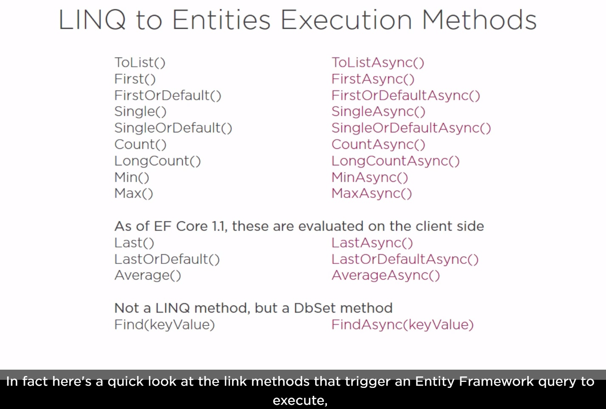
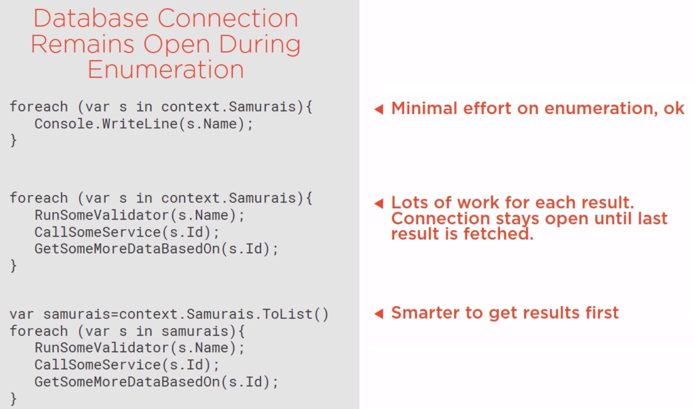

# Pluralsight Course

The projects and source code here are the practice of this course:
[Entity Framework Core: Getting Started](https://app.pluralsight.com/library/courses/entity-framework-core-getting-started/table-of-contents)

## Some Key Slides To Remember

### Linq Query Execution Methods With Their Async Counterparts

### Database Connection Remains Open During Enumeration
